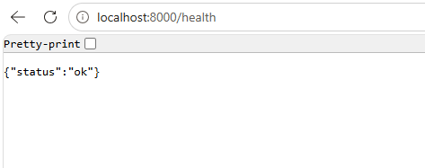
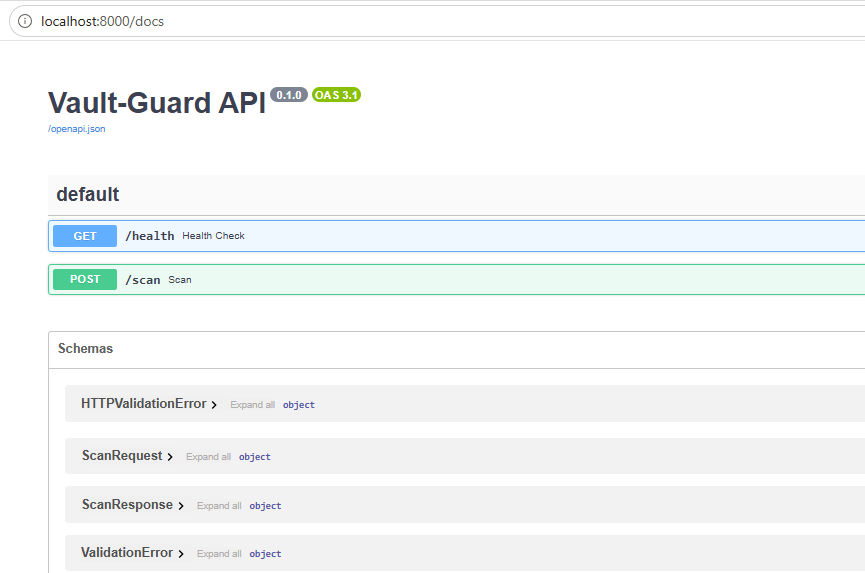
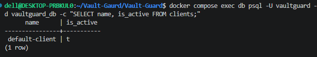

<div align="center">

# 🛡️ Vault-Guard

**Automated container security scanning for your CI/CD pipeline.**

Vault-Guard inspects every Dockerfile and its dependencies before it ever reaches production — catching bad practices and known vulnerabilities, and blocking the merge if something's wrong.

</div>

---

## Table of Contents

- [What is Vault-Guard?](#what-is-vault-guard)
- [Why it exists](#why-it-exists)
- [How it works](#how-it-works)
- [Architecture](#architecture)
- [Tech Stack](#tech-stack)
- [Getting Started](#getting-started)
- [Usage](#usage)
- [GitHub Actions Integration](#github-actions-integration)
- [Database Schema](#database-schema)
- [Project Structure](#project-structure)
- [Screenshots](#screenshots)
- [Roadmap](#roadmap)
- [Known Limitations](#known-limitations)
- [Security](#security)

---

## What is Vault-Guard?

Vault-Guard is a self-hosted **DevSecOps API** that plugs into your CI/CD pipeline. On every pull request, it:

1. Lints your `Dockerfile` for bad practices (running as `root`, using `:latest` tags, missing best practices, etc.)
2. Scans your dependency file (`requirements.txt`, `package.json`, ...) for known CVEs
3. Decides **pass** or **fail** based on a configurable policy
4. Logs the result for auditing, and pings **Discord** with the exact violations if it fails
5. Returns a non-zero exit code so GitHub Actions blocks the merge automatically

No manual security review needed on every PR — the pipeline enforces it for you.

---

## Why it exists

Most teams either skip container security entirely, or bolt it on manually with someone eyeballing Dockerfiles in code review. Vault-Guard automates that away using two proven open-source scanners (**Hadolint** and **Trivy**), wrapped in a small API your CI can call, with results you can actually query and audit later — not just console output that disappears after the build.

---

## How it works

```
 1. Developer opens a Pull Request containing a Dockerfile
                        │
 2. GitHub Actions calls Vault-Guard's /scan endpoint
                        │
 3. Vault-Guard runs Hadolint (Dockerfile lint) + Trivy (dependency CVEs)
                        │
 4. The Policy Engine decides: pass or fail?
                        │
 5. Result is saved to PostgreSQL (audit trail)
                        │
 6. If failed → Discord gets a detailed alert + GitHub Actions exits 1
    If passed → GitHub Actions exits 0, PR can be merged
```

---

## Architecture

```
Developer Push/PR
        │
        ▼
GitHub Actions Workflow ──HTTPS + API Key──► Caddy (Reverse Proxy / TLS)
                                                       │
                                                       ▼
                                              FastAPI (Vault-Guard API)
                                                       │
                                    ┌──────────────────┼──────────────────┐
                                    ▼                  ▼                  ▼
                              Hadolint            Trivy (fs)         PostgreSQL
                          (Dockerfile lint)   (Dependency CVEs)    (scan_results)
                                    │                  │
                                    └────────┬─────────┘
                                             ▼
                                       Policy Engine
                                     (pass / fail verdict)
                                             │
                              ┌──────────────┴──────────────┐
                              ▼                              ▼
                       JSON Response                  Discord Webhook
                    → GitHub Actions                   (on fail only)
                     (exit 0 / exit 1)
```

### Key architectural decisions

| Decision | Choice | Why |
|---|---|---|
| Tenancy | Single-tenant, multi-tenant-ready | A `clients` table exists from day one, even with a single client today — adding a new one is a row, not a rewrite |
| Deployment | Single VM + Docker Compose | Right-sized for the actual load — Kubernetes here would be over-engineering |
| Trigger | GitHub Actions webhook only | Simple, synchronous request/response — no queue needed at this scale |
| Scan mode | **Static analysis only** — no Docker socket | A security tool that mounts `docker.sock` becomes the biggest attack surface in the system. Vault-Guard scans Dockerfiles and dependency manifests directly, without needing a built image or privileged Docker access |

---

## Tech Stack

| Layer | Technology | Why |
|---|---|---|
| API | **FastAPI** | Async, built-in request validation, auto-generated OpenAPI docs |
| Dockerfile linting | **Hadolint** | Industry-standard Dockerfile linter |
| Vulnerability scanning | **Trivy** (`fs` mode) | Scans dependency manifests for known CVEs, no image build required |
| Database | **PostgreSQL** | Full audit trail of every scan, queryable JSONB for raw scanner output |
| Reverse proxy | **Caddy** | Automatic HTTPS with minimal config |
| Notifications | **Discord Webhooks** | Zero-dependency HTTP alerts straight to your team's channel |
| Orchestration | **Docker Compose** | The whole stack comes up with one command |

---

## Getting Started

### Prerequisites

- Docker & Docker Compose

### Installation

```bash
git clone https://github.com/SamarMahmoud10/Vault-Guard
cd vault-guard
cp .env.example .env
```

Open `.env` and set your own values (API key, DB password, and optionally a Discord webhook URL).

```bash
docker compose up --build
```

First build takes a few minutes — it downloads the Hadolint/Trivy binaries and Trivy's vulnerability database. Subsequent builds are much faster thanks to Docker layer caching.

### Verify it's running

```bash
curl http://localhost:8000/health
# {"status":"ok"}
```

Open the interactive API docs in your browser:
```
http://localhost:8000/docs
```

---

## Usage

### Scanning a Dockerfile — example that **fails**

```bash
curl -X POST http://localhost:8000/scan \
  -H "X-API-Key: your_api_key" \
  -H "Content-Type: application/json" \
  -d '{
    "repo_name": "example/bad-app",
    "commit_sha": "a1b2c3d",
    "dockerfile_content": "FROM node:latest\nUSER root\nRUN npm install",
    "dependency_file_name": "requirements.txt",
    "dependency_file_content": "flask==0.12.2\nrequests==2.6.0"
  }'
```

**Response:**
```json
{
  "status": "fail",
  "violations": [
    {
      "source": "hadolint",
      "line": 1,
      "code": "DL3007",
      "message": "Using latest is prone to errors if the image will ever update. Pin the version explicitly to a release tag"
    },
    {
      "source": "hadolint",
      "line": 2,
      "code": "DL3002",
      "message": "Last USER should not be root"
    },
    {
      "source": "trivy",
      "package": "flask",
      "vulnerability_id": "CVE-2019-1010083",
      "severity": "HIGH"
    }
  ],
  "scan_id": "3f2a1b9e-....."
}
```

Merge blocked ❌ — and the same details land in Discord.

---

### Scanning a Dockerfile — example that **passes**

```bash
curl -X POST http://localhost:8000/scan \
  -H "X-API-Key: your_api_key" \
  -H "Content-Type: application/json" \
  -d '{
    "repo_name": "example/good-app",
    "commit_sha": "e4f5g6h",
    "dockerfile_content": "FROM python:3.12-slim\nWORKDIR /app\nRUN useradd -m appuser\nUSER appuser\nCMD [\"python3\"]"
  }'
```

**Response:**
```json
{
  "status": "pass",
  "violations": [],
  "scan_id": "9c8d7e6f-....."
}
```

Merge allowed ✅.

---

## GitHub Actions Integration

Copy [`templates/github-actions-workflow.yml`](./templates/github-actions-workflow.yml) into any repo you want protected, at `.github/workflows/vault-guard.yml`.

Add two repository secrets:

| Secret | Value |
|---|---|
| `VAULT_GUARD_URL` | Your deployed Vault-Guard URL (e.g. `https://vault-guard.yourcompany.com`) |
| `VAULT_GUARD_API_KEY` | The API key for that repo's client |

The workflow automatically detects `requirements.txt` or `package.json` in the repo, sends it alongside the Dockerfile, and fails the check (blocking the merge) if Vault-Guard returns anything other than `pass`.

> ⚠️ This only works once Vault-Guard is deployed somewhere with a public URL — GitHub-hosted runners can't reach your `localhost`. See [Known Limitations](#known-limitations).

---

## Database Schema

**`clients`** — who's allowed to call the API

| Column | Type | Description |
|---|---|---|
| id | UUID (PK) | Non-sequential identifier |
| name | TEXT | Company/project name |
| api_key_hash | TEXT | SHA-256 hash of the API key — never stored in plaintext |
| created_at | TIMESTAMP | |
| is_active | BOOLEAN | Disable a client without deleting it |

**`scan_results`** — every scan ever run, kept for audit purposes

| Column | Type | Description |
|---|---|---|
| id | UUID (PK) | |
| client_id | UUID (FK → clients.id) | Who submitted the scan |
| repo_name | TEXT | |
| commit_sha | TEXT | Ties the result to an exact commit |
| status | TEXT (`pass`/`fail`) | |
| hadolint_raw | JSONB | Full raw Hadolint output |
| trivy_raw | JSONB | Full raw Trivy output |
| policy_violations | JSONB | The specific violations that caused a fail |
| created_at | TIMESTAMP | |

`clients` 1 → N `scan_results`

---

## Project Structure

```
vault-guard/
├── README.md
├── docker-compose.yml
├── .env / .env.example
├── .gitignore
├── api/
│   ├── Dockerfile           # installs Hadolint + Trivy, runs as non-root
│   ├── requirements.txt
│   ├── main.py               # FastAPI app — /health and /scan
│   ├── database.py           # SQLAlchemy engine/session
│   ├── models.py              # Client, ScanResult
│   ├── schemas.py             # Pydantic request/response models
│   ├── scanners.py            # subprocess wrappers around Hadolint/Trivy
│   ├── policy.py               # pass/fail decision logic
│   └── notifier.py             # Discord webhook alerts
├── templates/
│   └── github-actions-workflow.yml   # drop-in workflow for any repo
└── docs/
    └── screenshots/
```

---

## Screenshots

**Health check**



**Interactive API docs (Swagger UI)**



**Client seeded in the database**



---

## Roadmap

| Phase | Status |
|---|---|
| Architecture & tech stack design | ✅ Done |
| Database design | ✅ Done |
| Local dev environment (Docker Compose) | ✅ Done |
| Core API + Hadolint/Trivy integration | ✅ Done |
| Policy Engine | ✅ Done |
| Discord notifications | ✅ Done |
| GitHub Actions template | ✅ Done |
| Production deployment | ⏳ In progress |
| Alembic migrations | ⏳ Planned |
| Automated tests | ⏳ Planned |
| Docker-outside-of-Docker scanning (hardened) | 🎯 Stretch goal |

---

## Known Limitations

- **Not yet deployed** — currently runs locally only (`docker compose up`). The GitHub Actions template is fully wired but needs `VAULT_GUARD_URL` to be a public HTTPS address to actually work against a real repo.
- **No migrations yet** — the database schema is created via SQLAlchemy's `create_all()`. That's fine for now, but not safe once there's real data and the schema needs to change (Alembic is planned).
- **No automated tests yet.**
- **Trivy scans dependency manifests, not built images** — a deliberate trade-off to avoid mounting the Docker socket. Scanning actual built images is planned as a hardened, opt-in advanced feature.

---

## Security

- All secrets live in `.env`, which is git-ignored — never committed
- API keys are stored as SHA-256 hashes only, never in plaintext
- **Fail-closed by design:** if Hadolint or Trivy crash mid-scan, the result is recorded as `fail` automatically — a scan that couldn't actually run is never treated as "no issues found"
- No Docker socket access — Vault-Guard cannot escape its own container, by design